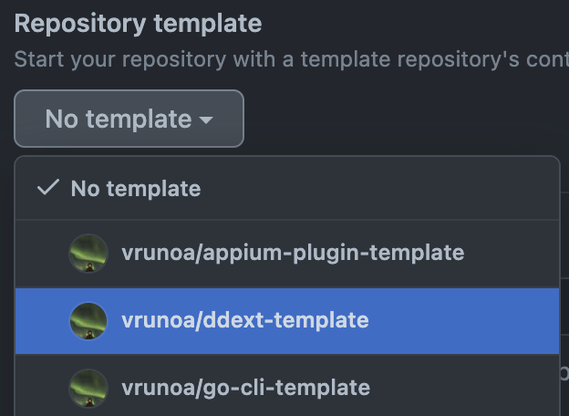

# ddext-template

A template for building Docker Extensions

## Usage

When creating a new repository, pick this repository as template.



## Features

This basic repo contains:

* Basic code for ui & vm extended from `docker extension init`

* Extended make tasks:
  * rm-extention
  * validate-extension
  * dev-reset
  * dev-debug
  * dev-ui
  * tail-extension

* Github workflows for:
  * Lint, using [golangci-lint](https://golangci-lint.run/)
  * Unit test with code coverage using [goverreport](https://github.com/mcubik/goverreport)
  * Release pipeline, pushing extension image to Docker Hub

## Troubleshooting

In order for buildx to be able to push to Docker hub, remember to set up the `DOCKER_USER` & `DOCKER_PAT` required secrets on the Github project defined in the release pipeline

```yaml
- name: docker login
    uses: docker/login-action@v2
    with:
        username: ${{ secrets.DOCKER_USER }}
        password: ${{ secrets.DOCKER_PAT }}
```

Learn how to generate a Docker Hub PAT [here](https://docs.docker.com/docker-hub/access-tokens/)